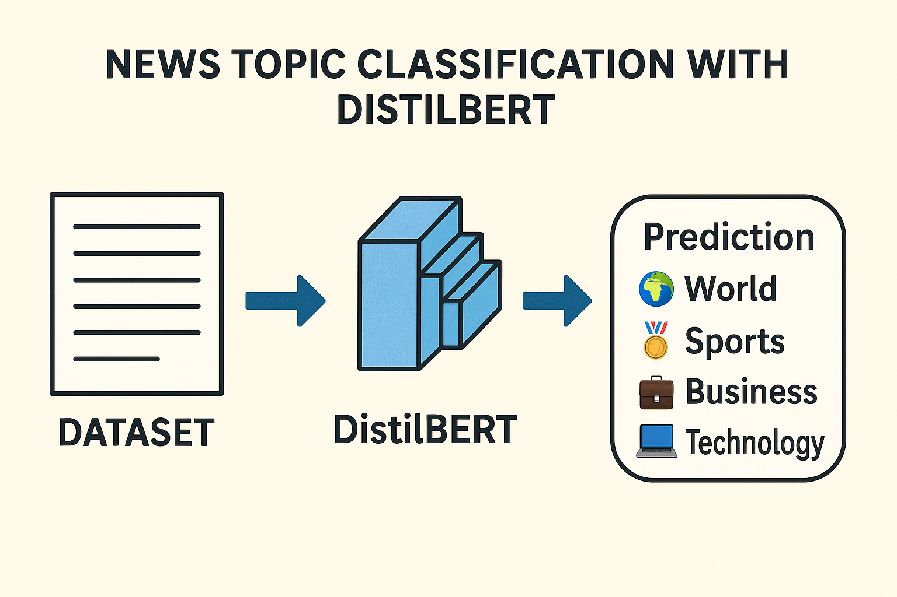

<h1 align="center">Advanced News Topic Classification with DistilBERT</h1>
<p align="center">
  
</p>

A comprehensive deep learning project implementing state-of-the-art news topic classification using the DistilBERT transformer model. The system automatically categorizes news articles into four distinct topics with 92.5% accuracy while implementing advanced overfitting prevention techniques.

---

## 🚀 Table of Contents

- [✨ Features](#-features)
- [🗂️ Project Structure](#️-project-structure)
- [📊 Dataset Overview](#-dataset-overview)
- [🛠️ Installation](#️-installation)
- [▶️ Usage](#️-usage)
- [📈 Results & Visualizations](#-results--visualizations)
- [🔬 Technical Implementation](#-technical-implementation)
- [🤝 Contributing](#-contributing)
- [📄 License](#-license)

---

## ✨ Features

### 📦 Dataset & Model

- AG News Corpus: 120,000 articles, 4 categories
- DistilBERT-base-uncased (66M parameters)
- Sequence classification head for multi-class prediction
- Tokenization capped at 256 tokens

### 🔧 ML Techniques

- Early stopping with validation monitoring
- Cosine learning rate scheduling
- Weight decay (L2 regularization)
- Dropout regularization (0.3)
- Best model checkpointing

### 📊 Performance

- Peak Accuracy: **92.92%**
- Final Accuracy: **92.46%**
- F1-Score: **92.44%**
- Training stopped early at 4,250 steps

### ⚙️ Production Features

- Complete inference pipeline
- Model serialization
- Tested on real-world inputs

### 🧰 Tech Stack

- PyTorch, Hugging Face Transformers
- scikit-learn, pandas, matplotlib

---

## 🗂️ Project Structure

```

├── .gitignore
├── LICENSE
├── README.md
├── image.png
├── requirements.txt
├── News_Classification.ipynb

````

---

## 📊 Dataset Overview

The **AG News Dataset** includes categorized news articles across four domains:

| Category        | Description                                  | Training | Test |
|----------------|----------------------------------------------|----------|------|
| 🌍 **World**    | Global news and international affairs        | 30,000   | 1,900 |
| 🏈 **Sports**   | Games, tournaments, and athlete updates      | 30,000   | 1,900 |
| 💼 **Business** | Market, finance, and economic reports        | 30,000   | 1,900 |
| 💻 **Tech**     | Tech innovations, gadgets, and launches      | 30,000   | 1,900 |

**Details**:
- Total: 120,000 train + 7,600 test
- Avg. Length: 150 words/article
- Preprocessed via DistilBERT tokenizer (`max_length=256`)
- Perfectly balanced dataset

---

## 🛠️ Installation

```bash
# Step 1: Clone the repository
git clone https://github.com/X-XENDROME-X/News-Classification-Transformer.git

# Step 2: Set up virtual environment
python3 -m venv venv
source venv/bin/activate  # Windows: venv\Scripts\activate

# Step 3: Install dependencies
pip install -r requirements.txt

# Step 4: Launch Jupyter
jupyter notebook News_Classification.ipynb
````

---

## ▶️ Usage

### 🔬 Full Training Pipeline

Inside the notebook:

1. Environment setup
2. Dataset loading & exploration
3. Tokenization
4. Model setup & training
5. Evaluation
6. Inference with real data

### 🎯 Quick Prediction

```python
from transformers import pipeline
import torch

classifier = pipeline(
    "text-classification",
    model="./models/best_news_classifier",
    device=0 if torch.cuda.is_available() else -1
)

def classify_news(text):
    result = classifier(text)[0]
    return result['label'], result['score']

news_text = "Apple reports record quarterly earnings with strong iPhone sales driving revenue growth"
category, confidence = classify_news(news_text)

print(f"Category: {category}")
print(f"Confidence: {confidence:.3f}")
```

---

## 📈 Results & Visualizations

### 🧪 Training Performance

| Metric              | Step 3750 | Step 4250 | Status       |
| ------------------- | --------- | --------- | ------------ |
| Validation Accuracy | 92.92%    | 92.46%    | ✅ Excellent  |
| Validation Loss     | 0.2199    | 0.2346    | ✅ Controlled |
| F1-Score            | 92.93%    | 92.44%    | ✅ Balanced   |
| Overfitting Gap     | -         | 6.7%      | ✅ Minimal    |

### 🏆 Highlights

* 🎯 92.92% peak accuracy
* 🛡️ Early stopping effective
* ⚡ Efficient: only 4,250 steps
* 🎭 Balanced across all classes
* 🚀 Production-ready pipeline

---

## 🔬 Technical Implementation

### 🧠 Overfitting Control

* Early stopping (patience=2)
* Dropout (0.3)
* Weight decay
* Cosine learning rate scheduler

### ⚡ Optimization Techniques

* Mixed precision (FP16)
* Gradient accumulation
* Dynamic padding
* Best checkpoint saving

### 📈 Evaluation Metrics

* Accuracy, Precision, Recall, F1
* Confusion matrix
* Per-class analysis
* Real-world input validation

### 📊 Model Comparison

| Model             | Accuracy | Params | Training Time | Overfitting |
| ----------------- | -------- | ------ | ------------- | ----------- |
| DistilBERT (ours) | 92.46%   | 66M    | 4,250 steps   | ✅ Low       |
| BERT-base         | \~94%    | 110M   | \~8,000 steps | Medium      |
| Traditional ML    | \~85%    | <1M    | Fast          | High        |
| Simple CNN        | \~88%    | \~10M  | Medium        | High        |

---

## 🤝 Contributing

### 🧩 How to Contribute

1. Fork the repo
2. Create a feature branch
3. Commit changes
4. Push to your fork
5. Open a PR

### 💡 Contribution Ideas

* RoBERTa/ELECTRA integration
* Multilingual support
* Real-time API
* Quantization/pruning
* Advanced metrics
* Deployment scripts (Docker, GCP, etc.)

---

## 📄 License

MIT License. See [LICENSE](LICENSE) for details.

